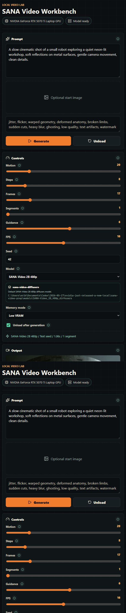

# SANA Video Local UI

A local React + FastAPI workbench for running the available SANA-Video 2B diffusers model on consumer GPUs.

This repository contains only the UI and backend wrapper. It does not include model weights.



## Current Status

- SANA-Video 2B Diffusers: supported in the React + FastAPI workbench.
- SANA-WM: experimentally verified through WSL2 CLI scripts, not yet wired into the UI.

The SANA-WM path uses the official NVLabs inference script and Linux CUDA
dependencies. See [Experimental SANA-WM on WSL2](docs/sana-wm-wsl2.md).

## Features

- Text-to-video and image-to-video generation.
- Chained segment generation for longer clips using each segment's last frame as the next start image.
- Low VRAM mode using sequential CPU offload.
- Balanced mode for faster runs when your GPU has enough headroom.
- Model profile selector for swapping local model folders without editing UI code.
- Job queue with progress, current step, elapsed time, and output gallery.
- Windows-friendly defaults tested around a 12 GB laptop GPU.

## Model Compatibility

Download the model separately from Hugging Face:

`Efficient-Large-Model/SANA-Video_2B_480p_diffusers`

Set `SANA_MODEL_DIR` to the downloaded model folder, or place the model at:

`models/SANA-Video_2B_480p_diffusers`

Model weights and generated outputs are ignored by git.

The current UI backend adapter supports the SANA-Video diffusers pipeline family:

- `SanaVideoPipeline` for text-to-video.
- `SanaImageToVideoPipeline` for image-to-video start frames.

SANA-WM is a different path today. The public release uses the official NVLabs
script with camera/action controls, prompt files, and Linux-friendly Triton
dependencies. A tiny WSL2 stage-1/no-refiner probe is included in
[`scripts/wsl/`](scripts/wsl/) and documented in
[`docs/sana-wm-wsl2.md`](docs/sana-wm-wsl2.md). A proper UI adapter should be
added before SANA-WM appears as a selectable workbench model.

Optional local model profiles can be defined in `model-profiles.local.json` at the repo root. This file is ignored by git so machine-specific paths do not leak into public commits:

```json
[
  {
    "id": "sana-video-2b-480p",
    "label": "SANA-Video 2B 480p",
    "path": "C:/models/SANA-Video_2B_480p_diffusers",
    "pipelineFamily": "sana-video-diffusers",
    "description": "Current SANA-Video diffusers release."
  }
]
```

You can also provide the same JSON array through `SANA_MODEL_PROFILES_JSON`.

## Longer Videos

The app avoids asking the GPU to render one large clip in a single pass. Instead, set `Segments` above `1`. The first segment uses text-to-video unless you upload a start image. Each later segment uses the previous segment's last generated frame as its start image, then the backend exports the combined frames as one MP4.

For example, `49` frames, `8` FPS, and `4` segments produces about `24` seconds of video:

`49 + (4 - 1) * 48 = 193 frames`

The first frame of each chained continuation is skipped during assembly to reduce visible duplicate-frame pauses.

## Backend

Create a Python environment and install PyTorch for your CUDA setup first. On the tested Windows machine, CUDA 12.8 wheels worked:

```powershell
python -m pip install --index-url https://download.pytorch.org/whl/cu128 torch torchvision torchaudio
python -m pip install -r backend\requirements.txt
```

Run the backend:

```powershell
$env:SANA_MODEL_DIR="C:\path\to\SANA-Video_2B_480p_diffusers"
python -m uvicorn backend.app:app --host 127.0.0.1 --port 8008
```

## Frontend

```powershell
cd frontend
npm install
npm run dev
```

Open:

`http://127.0.0.1:5173`

## One-Command Dev Run

From the repo root:

```powershell
powershell -ExecutionPolicy Bypass -File .\scripts\run_dev.ps1
```

## Experimental SANA-WM Probe

For Windows machines, use WSL2:

```powershell
powershell -ExecutionPolicy Bypass -File .\scripts\wsl\enable_wsl2_windows.ps1
wsl.exe --install -d Ubuntu
wsl.exe -d Ubuntu -- nvidia-smi
```

Then follow [docs/sana-wm-wsl2.md](docs/sana-wm-wsl2.md). The verified tiny
probe uses `--no_refiner`, `--offload_vae`, `17` frames, `8` FPS, and the
official SANA-WM demo assets.

## Promo Kit

Public-safe sharing copy, a demo script, a release checklist, and reusable visual assets live in [`promo/`](promo/README.md).

## Safe Starting Settings

For 12 GB laptop GPUs, start with:

- Memory mode: `low`
- Frames: `17` or `25`
- Segments: `1` or `2`; try `4` after short runs succeed
- Steps: `8` or `12`
- Unload after generation: enabled

Scale up after a successful run.

For SANA-WM, start with the WSL2 stage-1 probe before attempting longer clips
or the full refiner stack.

## License Notes

The app code in this repository is MIT licensed. SANA model weights, upstream model code, PyTorch, diffusers, and other dependencies remain governed by their own licenses and terms.

This public UI intentionally avoids paid React Bits Pro source code or private registry components.
